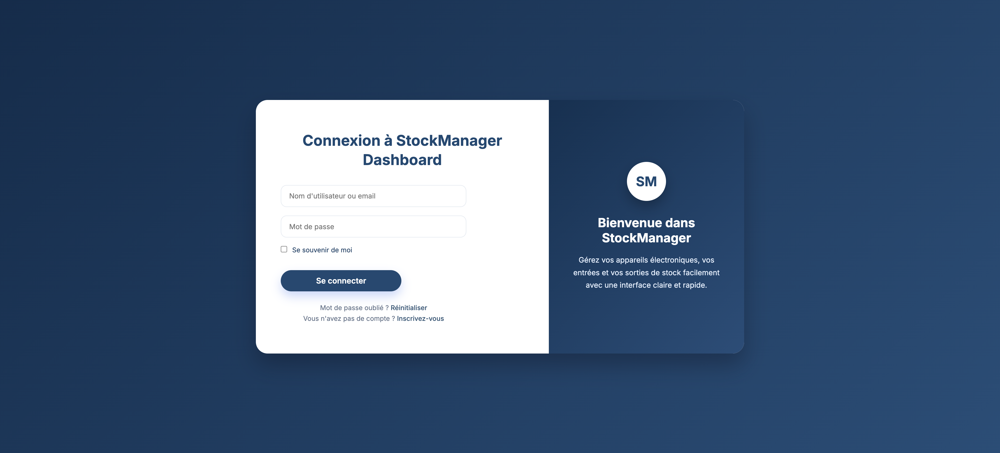
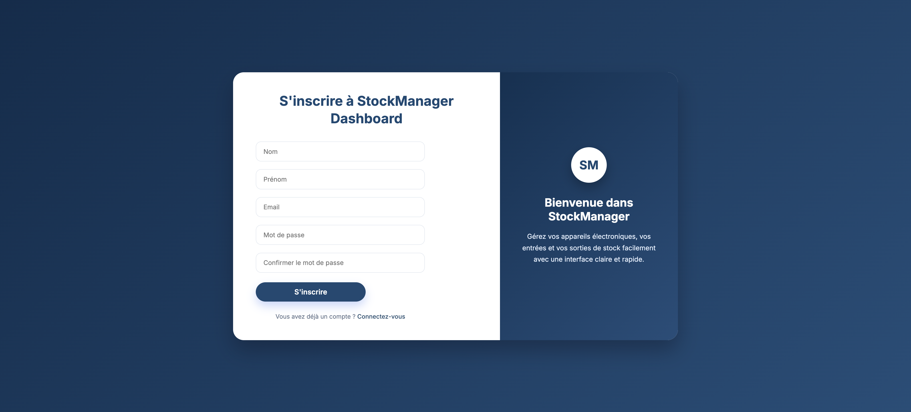
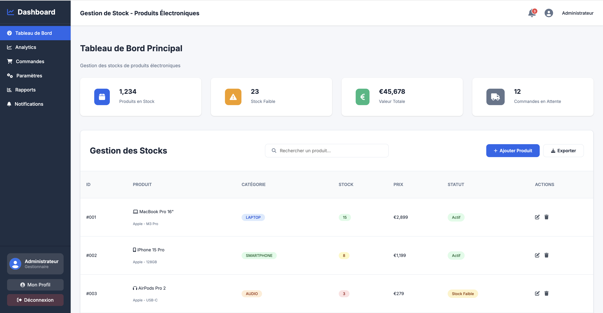
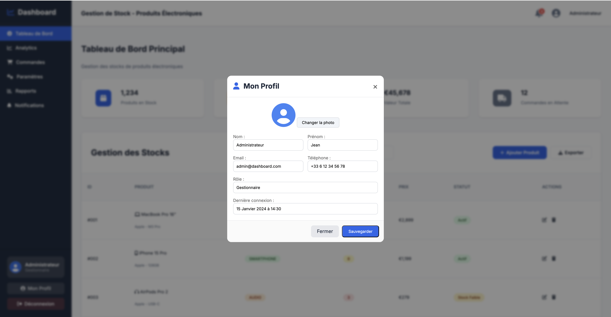
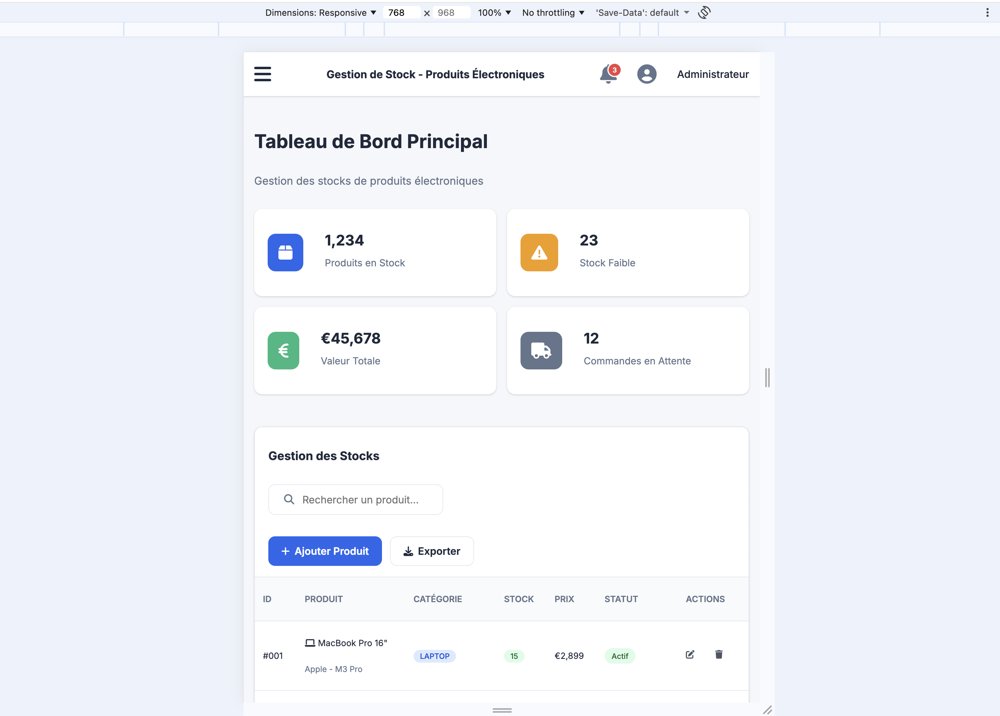
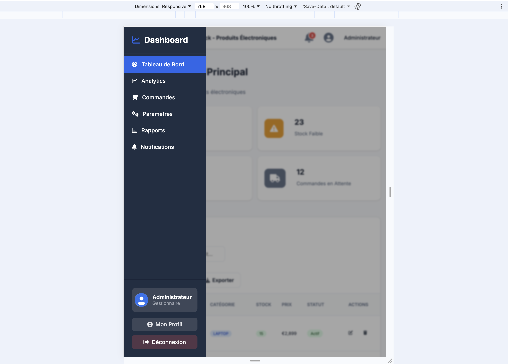

# StockManager Dashboard

Interface d’administration responsive pour la **gestion des stocks de produits électroniques**.  
Ce projet a été réalisé dans le cadre de la formation *Développement Web – Niveau intermédiaire*.

---

##  Aperçu

Le tableau de bord permet à un gestionnaire de :

- Suivre les **indicateurs clés** (ventes, commandes, nouveaux clients, taux de conversion…)
- Visualiser des **rapports & historiques** sous forme de cartes et de tableaux
- Consulter les **notifications** importantes (stock critique, nouvelles commandes…)
- Accéder à un **profil utilisateur** via un popup en pur HTML/CSS
- Naviguer facilement entre les pages grâce à une **sidebar responsive**

---

##  Fonctionnalités principales

- **Pages dédiées** : Dashboard, Analytics, Commandes, Paramètres, Rapports, Notifications  
- **Sidebar fixe sur desktop**, transformée en **menu burger** sur mobile (overlay + clic pour fermer)
- **Topbar** avec icône de notification animée (badge rouge + effet de “pulse”)
- **Cartes statistiques** modernes (icône à gauche, chiffres en grand, badges de variation colorés)
- **Filtres de rapports** (type, période, format) avec bouton d’action principal
- **Historique des rapports** :
  - Table classique sur grand écran
  - Transformation en **cartes verticales** sur mobile (thead masqué, labels générés en CSS)
- **Popup “Mon profil”** géré entièrement en HTML/CSS (checkbox + overlay flou)
- Design conforme à une **charte de style** (palette, typographie Inter, ombres, arrondis)

## Technologies utilisées

- HTML5 (structure sémantique)
- CSS3 (Flexbox, Grid, media queries, animations simples)
- Font Awesome 6 (icônes)
- Google Fonts – Inter

## Prise en main

### Cloner le dépôt :
- git clone : https://github.com/Abdallah-Alher/Stock_Manager.git

### Ouvrir le projet
- Ouvre index.html directement dans ton navigateur
- Lance une extension type Live Server dans VS Code.

### Navigation
- Connexion → redirection vers dashboard.html
- Utilise la sidebar pour passer d’une section à l’autre.

---

## Difficultés rencontrées & solutions

1. Gestion de la sidebar responsive 
- Difficulté à ouvrir/fermer le menu avec un simple clic sur le burger et à fermer en cliquant sur le fond.
- Solution : utilisation d’un input[type="checkbox"] caché (#nav-toggle), d’un label pour le burger, et d’un second label pleine 
page pour l’overlay, avec des règles .nav-toggle:checked ~ .sidebar et .nav-toggle:checked ~ .sidebar-overlay.

2. Transformation du tableau en cartes sur mobile
- Le tableau débordait et restait difficile à lire sur 768 px.
- Solution : on masque <thead>, on affiche chaque <tr> en display: block avec ombre et bordure arrondie, 
  et on injecte les labels (“Type :”, “Date :”, “Statut :”) via td:nth-child()::before.

3. Respect pixel-perfect de la maquette (espacements, alignements)
- Obtenir exactement la même apparence : badges, arrondis, couleurs, layout.
- Solution : décomposition de la maquette en composants (cartes, entête de tableau, filtres, badges) et mise en place d’une 
  charte CSS globale (variables :root, espaces, tailles de texte, ombres) réutilisée sur toutes les pages.

---

## Liens importants

- Dépôt GitHub : https://github.com/Abdallah-Alher/Stock_Manager.git

- Version déployée : https://abdallah-alher.github.io/Stock_Manager/

---

### Auteur

- ALHER MATOU Abdallah
- Formation CODELOCCOL

Quelques Captures :

